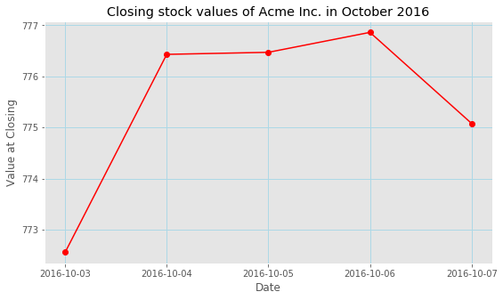
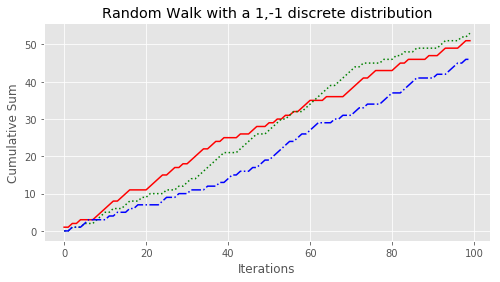
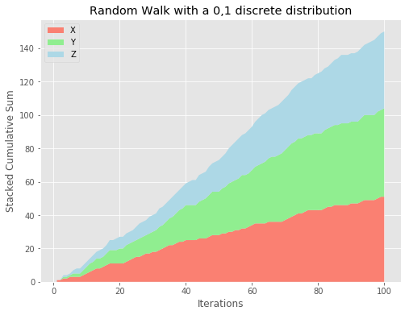

## Exercise 1:

Write a Python program to display the grid and draw line chart for closing values of Acme Inc. between October 3, 2016 to October 7, 2016. 

Customize the grid lines with:

* A red line with style '-o', width: 1
* Label x and y axis with 
* Give a title to the plot 
* Put date values at x-axis (date2num function shown below)
* Change the color of grid to light blue and width = 1
* Note: Convert dates to datetime format for such problems. Code for this is given below
 
    Date, Close
    
    03-10-16,772.559998
    
    04-10-16,776.429993
    
    05-10-16,776.469971
    
    06-10-16,776.859985
    
    07-10-16,775.080017


```python
# Import necessary libraries
import datetime as DT
from matplotlib.dates import date2num
import matplotlib.pyplot as plt
plt.style.use('ggplot')
```


```python
# Prepare the data and change the dates to datetime format.
data = [(DT.datetime.strptime('2016-10-03', "%Y-%m-%d"), 772.559998),
        (DT.datetime.strptime('2016-10-04', "%Y-%m-%d"), 776.429993),
        (DT.datetime.strptime('2016-10-05', "%Y-%m-%d"), 776.469971),
        (DT.datetime.strptime('2016-10-06', "%Y-%m-%d"), 776.859985),
        (DT.datetime.strptime('2016-10-07', "%Y-%m-%d"), 775.080017 )]

x = [date2num(date) for (date, value) in data]
y = [value for (date, value) in data]
```


```python
# Create a new figure with a single axes

# Plot the data as a red line and round markers (r-o)

# Set the xtick locations at x
# ax.set_xticks(x)
# ax.set_xticklabels([date.strftime("%Y-%m-%d") for (date, value) in data])

# Label x and y axis

# Set a title for the plot 

# Customize the grid
```


```python

```





## Exercise 2:
Create a multiple line plot for the data given below. 
* x, y and z are calculated here with a random walk function which samples from a discrete distribution of [0, 1]. * Use these values to draw a multiple line plot. 
* Give red, green and blue colors to x,y and z and use different line styles for showing each line. 
* Label the x and y axis and give a suitable title to the plot. 


```python
def random_walk():
    walk = np.random.choice([0,1],size=100, replace=True) # Sample with replacement from (-1, 1)
    return np.cumsum(walk) # Return the cumulative sum of the elements

# Call the random walk function to get values for x,y and z
x = None
y = None
z = None
```


```python
# Create a new figure with a single axis

# Plot the data for india and pakistan on the same axes

# Set the x and y labels

# Set the plot title and show the final plot
```


```python

```





## Exercise 3:

Change the multiple line plot above to a stacked area chart. 
* Create a list `xs` for passing the `x-ticks` values to the `stackplot()` method. 
* Set the range from 0 to 100 (according to sample size in the random walk function . 
* Fill the regions of x, y and z with light red, light blue and light green colors. 
* Provide meaning Labels and Title the plot.  


```python
# xs = np.arange(1,101)

# Combine data as a list of lists

# Create a new figure with a single axis

# Basic stacked area chart. Use primary flag colos to represent each country

# Set the x and y labels

# Set the plot title and show the final plot

```


```python

```




